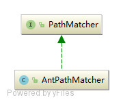

#### relationship with spring
[跳转到spring初始化AntPathMatcher的位置](read.md#abstractapplicationcontext-constructor)  
AbstractApplicationContext 构造函数 getResourcePatternResolver() 获取到 PathMatchingResourcePatternResolver实例，antpathmatcher 是该实例的字段

#### AntPathMatcher



#### AntPathMatcher.doMatch
```java
protected boolean doMatch(String pattern, String path, boolean fullMatch,
    @Nullable Map<String, String> uriTemplateVariables) {

  if (path.startsWith(this.pathSeparator) != pattern.startsWith(this.pathSeparator)) {
    return false;
  }

  String[] pattDirs = tokenizePattern(pattern);
  if (fullMatch && this.caseSensitive && !isPotentialMatch(path, pattDirs)) {
    return false;
  }

  String[] pathDirs = tokenizePath(path);

  int pattIdxStart = 0;
  int pattIdxEnd = pattDirs.length - 1;
  int pathIdxStart = 0;
  int pathIdxEnd = pathDirs.length - 1;

  // Match all elements up to the first **
  while (pattIdxStart <= pattIdxEnd && pathIdxStart <= pathIdxEnd) {
    String pattDir = pattDirs[pattIdxStart];
    if ("**".equals(pattDir)) {
      break;
    }
    if (!matchStrings(pattDir, pathDirs[pathIdxStart], uriTemplateVariables)) {
      return false;
    }
    pattIdxStart++;
    pathIdxStart++;
  }

  if (pathIdxStart > pathIdxEnd) {
    // Path is exhausted, only match if rest of pattern is * or **'s
    if (pattIdxStart > pattIdxEnd) {
      return (pattern.endsWith(this.pathSeparator) == path.endsWith(this.pathSeparator));
    }
    if (!fullMatch) {
      return true;
    }
    if (pattIdxStart == pattIdxEnd && pattDirs[pattIdxStart].equals("*") && path.endsWith(this.pathSeparator)) {
      return true;
    }
    for (int i = pattIdxStart; i <= pattIdxEnd; i++) {
      if (!pattDirs[i].equals("**")) {
        return false;
      }
    }
    return true;
  }
  else if (pattIdxStart > pattIdxEnd) {
    // String not exhausted, but pattern is. Failure.
    return false;
  }
  else if (!fullMatch && "**".equals(pattDirs[pattIdxStart])) {
    // Path start definitely matches due to "**" part in pattern.
    return true;
  }

  // up to last '**'
  while (pattIdxStart <= pattIdxEnd && pathIdxStart <= pathIdxEnd) {
    String pattDir = pattDirs[pattIdxEnd];
    if (pattDir.equals("**")) {
      break;
    }
    if (!matchStrings(pattDir, pathDirs[pathIdxEnd], uriTemplateVariables)) {
      return false;
    }
    pattIdxEnd--;
    pathIdxEnd--;
  }
  if (pathIdxStart > pathIdxEnd) {
    // String is exhausted
    for (int i = pattIdxStart; i <= pattIdxEnd; i++) {
      if (!pattDirs[i].equals("**")) {
        return false;
      }
    }
    return true;
  }

  while (pattIdxStart != pattIdxEnd && pathIdxStart <= pathIdxEnd) {
    int patIdxTmp = -1;
    for (int i = pattIdxStart + 1; i <= pattIdxEnd; i++) {
      if (pattDirs[i].equals("**")) {
        patIdxTmp = i;
        break;
      }
    }
    if (patIdxTmp == pattIdxStart + 1) {
      // '**/**' situation, so skip one
      pattIdxStart++;
      continue;
    }
    // Find the pattern between padIdxStart & padIdxTmp in str between
    // strIdxStart & strIdxEnd
    int patLength = (patIdxTmp - pattIdxStart - 1);
    int strLength = (pathIdxEnd - pathIdxStart + 1);
    int foundIdx = -1;

    strLoop:
    for (int i = 0; i <= strLength - patLength; i++) {
      for (int j = 0; j < patLength; j++) {
        String subPat = pattDirs[pattIdxStart + j + 1];
        String subStr = pathDirs[pathIdxStart + i + j];
        if (!matchStrings(subPat, subStr, uriTemplateVariables)) {
          continue strLoop;
        }
      }
      foundIdx = pathIdxStart + i;
      break;
    }

    if (foundIdx == -1) {
      return false;
    }

    pattIdxStart = patIdxTmp;
    pathIdxStart = foundIdx + patLength;
  }

  for (int i = pattIdxStart; i <= pattIdxEnd; i++) {
    if (!pattDirs[i].equals("**")) {
      return false;
    }
  }

  return true;
}
```

#### String[] pattDirs = tokenizePattern(pattern);
```java
protected String[] tokenizePath(String path) {
  return StringUtils.tokenizeToStringArray(path, this.pathSeparator, this.trimTokens, true);
}
```

<details>    
<summary>StringUtils.tokenizeToStringArray</summary>

#### StringUtils.tokenizeToStringArray
```java
public static String[] tokenizeToStringArray(
		@Nullable String str, String delimiters, boolean trimTokens, boolean ignoreEmptyTokens) {

	if (str == null) {
		return new String[0];
	}

	StringTokenizer st = new StringTokenizer(str, delimiters);
	List<String> tokens = new ArrayList<>();
	while (st.hasMoreTokens()) {
		String token = st.nextToken();
		if (trimTokens) {
			token = token.trim();
		}
		if (!ignoreEmptyTokens || token.length() > 0) {
			tokens.add(token);
		}
	}
	return toStringArray(tokens);
}
```

#### StringTokenizer.hasMoreTokens
```java
// 设置newPosition为第一个非delimiters字符，判断从当前位置开始是否还有非delimiters字符
public boolean hasMoreTokens() {
    /*
     * Temporarily store this position and use it in the following
     * nextToken() method only if the delimiters haven't been changed in
     * that nextToken() invocation.
     */
    newPosition = skipDelimiters(currentPosition);
    return (newPosition < maxPosition);
}
```

#### newPosition = skipDelimiters(currentPosition);
```java
// 从startPos开始跳过所有的delimiter字符，返回第一个非delimiter字符
// 原则只要字符包含在delimiters中就跳过
private int skipDelimiters(int startPos) {
if (delimiters == null)
    throw new NullPointerException();

int position = startPos;
while (!retDelims && position < maxPosition) {
    if (!hasSurrogates) {
	char c = str.charAt(position);
	// 关键代码，当且仅当c，包含在delimiters中才会移动position
	// maxDelimCodePoint delimiters中最大字符的ascii码，这里采用短路或避免 indexof的性能损耗
	// 即：如果c都大于delimiters中最大的字符了，肯定不会包含在delimiters中，直接跳出循环
	if ((c > maxDelimCodePoint) || (delimiters.indexOf(c) < 0))
	    break;
	position++;
    } else {
	int c = str.codePointAt(position);
	if ((c > maxDelimCodePoint) || !isDelimiter(c)) {
	    break;
	}
	position += Character.charCount(c);
    }
}
return position;
}
```
#### StringUtils.nextToken
```java
public String nextToken() {
    /*
     * If next position already computed in hasMoreElements() and
     * delimiters have changed between the computation and this invocation,
     * then use the computed value.
     */

    currentPosition = (newPosition >= 0 && !delimsChanged) ?
        newPosition : skipDelimiters(currentPosition);

    /* Reset these anyway */
    delimsChanged = false;
    newPosition = -1;

    if (currentPosition >= maxPosition)
        throw new NoSuchElementException();
    int start = currentPosition;
    currentPosition = scanToken(currentPosition);
    // 这里start是第一个非delimiter位置，currentPosition是第一个delimiter位置或者最大位置
    // 返回值就是一个token
    return str.substring(start, currentPosition);
}
```

#### StringUtils.scanToken
```java
// 该方法的返回值，要么是第一个dilimiter位置，要么是最大位置
private int scanToken(int startPos) {
int position = startPos;
while (position < maxPosition) {
    if (!hasSurrogates) {
	char c = str.charAt(position);
	// 关键代码在第一个delimiter位置跳出
	if ((c <= maxDelimCodePoint) && (delimiters.indexOf(c) >= 0))
	    break;
	position++;
    } else {
	int c = str.codePointAt(position);
	if ((c <= maxDelimCodePoint) && isDelimiter(c))
	    break;
	position += Character.charCount(c);
    }
}
if (retDelims && (startPos == position)) {
    if (!hasSurrogates) {
	char c = str.charAt(position);
	if ((c <= maxDelimCodePoint) && (delimiters.indexOf(c) >= 0))
	    position++;
    } else {
	int c = str.codePointAt(position);
	if ((c <= maxDelimCodePoint) && isDelimiter(c))
	    position += Character.charCount(c);
    }
}
return position;
}
```
总结：StringUtils.tokenizeToStringArray 将一个字符串按照delimiters分隔为字符串数组  
分隔逻辑为：先找到第一个不包含在delimiters中的字符，设置该字符的位置为起始位置a
再从a开始找到第一个包含在delimiters中的字符（或者字符串结尾）,设置改位置为b
那么[a,b)的字符串就是一个token

```
注意：
因为只是判断字符是否在delimiters中，没有考虑顺序，所以
StringUtils.tokenizeToStringArray("123ab321", "ba", false, true); 的返回值为 [123, 321]
即ab可以分隔ba，甚至可以分隔abbbabaababababa
123ab321 : 路径
ba ： 分隔符
false : 是否截取首尾空格
true ：是否保留空字符串
```

[回到 StringUtils.tokenizeToStringArray](#stringutilstokenizetostringarray)
</details>


<details>    
<summary>isPotentialMatch(path, pattDirs)</summary>
	
#### isPotentialMatch
```java
// 应该是粗略排除明显不匹配的
// 全字符匹配，遇到 * ? { 时返回true!
private boolean isPotentialMatch(String path, String[] pattDirs) {
	if (!this.trimTokens) {
		int pos = 0;
		for (String pattDir : pattDirs) {
			int skipped = skipSeparator(path, pos, this.pathSeparator);
			pos += skipped;
			skipped = skipSegment(path, pos, pattDir);
			if (skipped < pattDir.length()) {
				return (skipped > 0 || (pattDir.length() > 0 && isWildcardChar(pattDir.charAt(0))));
			}
			pos += skipped;
		}
	}
	return true;
}

// 跳过分隔符
private int skipSeparator(String path, int pos, String separator) {
	int skipped = 0;
	while (path.startsWith(separator, pos + skipped)) {
		skipped += separator.length();
	}
	return skipped;
}

// 跳过匹配的字符
private int skipSegment(String path, int pos, String prefix) {
	int skipped = 0;
	for (int i = 0; i < prefix.length(); i++) {
		char c = prefix.charAt(i);
		if (isWildcardChar(c)) {
			return skipped;
		}
		int currPos = pos + skipped;
		if (currPos >= path.length()) {
			return 0;
		}
		if (c == path.charAt(currPos)) {
			skipped++;
		}
	}
	return skipped;
}
```
[回到 isPotentialMatch](#ispotentialmatch)
</details>


<details>    
<summary>matchStrings(pattDir, pathDirs[pathIdxStart], uriTemplateVariables)</summary>

#### matchStrings
```java
private boolean matchStrings(String pattern, String str,
		@Nullable Map<String, String> uriTemplateVariables) {

	return getStringMatcher(pattern).matchStrings(str, uriTemplateVariables);
}
```

```java
// 根据 pattern创建一个matcher然后缓存起来
protected AntPathStringMatcher getStringMatcher(String pattern) {
	AntPathStringMatcher matcher = null;
	Boolean cachePatterns = this.cachePatterns;
	if (cachePatterns == null || cachePatterns.booleanValue()) {
		matcher = this.stringMatcherCache.get(pattern);
	}
	if (matcher == null) {
		matcher = new AntPathStringMatcher(pattern, this.caseSensitive);
		if (cachePatterns == null && this.stringMatcherCache.size() >= CACHE_TURNOFF_THRESHOLD) {
			// Try to adapt to the runtime situation that we're encountering:
			// There are obviously too many different patterns coming in here...
			// So let's turn off the cache since the patterns are unlikely to be reoccurring.
			deactivatePatternCache();
			return matcher;
		}
		if (cachePatterns == null || cachePatterns.booleanValue()) {
			// 关键代码根据 pattern创建一个matcher然后缓存起来
			this.stringMatcherCache.put(pattern, matcher);
		}
	}
	return matcher;
}
```

#### AntPathMatcher$AntPathStringMatcher
```java
// 匹配：? , * , {a}, {{b}}, {\{} , {\}}
// a代表非 `/{}` b代表非 `/`
private static final Pattern GLOB_PATTERN = Pattern.compile("\\?|\\*|\\{((?:\\{[^/]+?\\}|[^/{}]|\\\\[{}])+?)\\}");

private static final String DEFAULT_VARIABLE_PATTERN = "(.*)";

private final List<String> variableNames = new LinkedList<>();

public AntPathStringMatcher(String pattern, boolean caseSensitive) {
	StringBuilder patternBuilder = new StringBuilder();
	Matcher matcher = GLOB_PATTERN.matcher(pattern);
	int end = 0;
	// matcher类有3个方法
	// find 寻找是否有第一个匹配的序列
	// lookingAt 从第一个位置开始寻找是否有第一个匹配的序列
	// matches 全匹配
	while (matcher.find()) {
		patternBuilder.append(quote(pattern, end, matcher.start()));
		String match = matcher.group();
		if ("?".equals(match)) {
			patternBuilder.append('.');
		}
		else if ("*".equals(match)) {
			patternBuilder.append(".*");
		}
		else if (match.startsWith("{") && match.endsWith("}")) {
			int colonIdx = match.indexOf(':');
			if (colonIdx == -1) {
				patternBuilder.append(DEFAULT_VARIABLE_PATTERN);
				this.variableNames.add(matcher.group(1));
			}
			else {
				String variablePattern = match.substring(colonIdx + 1, match.length() - 1);
				patternBuilder.append('(');
				patternBuilder.append(variablePattern);
				patternBuilder.append(')');
				String variableName = match.substring(1, colonIdx);
				this.variableNames.add(variableName);
			}
		}
		end = matcher.end();
	}
	patternBuilder.append(quote(pattern, end, pattern.length()));
	this.pattern = (caseSensitive ? Pattern.compile(patternBuilder.toString()) :
			Pattern.compile(patternBuilder.toString(), Pattern.CASE_INSENSITIVE));
}
		

```

```java
public boolean matchStrings(String str, @Nullable Map<String, String> uriTemplateVariables) {
	Matcher matcher = this.pattern.matcher(str);
	if (matcher.matches()) {
		if (uriTemplateVariables != null) {
			// SPR-8455
			if (this.variableNames.size() != matcher.groupCount()) {
				throw new IllegalArgumentException("The number of capturing groups in the pattern segment " +
						this.pattern + " does not match the number of URI template variables it defines, " +
						"which can occur if capturing groups are used in a URI template regex. " +
						"Use non-capturing groups instead.");
			}
			for (int i = 1; i <= matcher.groupCount(); i++) {
				String name = this.variableNames.get(i - 1);
				String value = matcher.group(i);
				uriTemplateVariables.put(name, value);
			}
		}
		return true;
	}
	else {
		return false;
	}
}
```
[回到 matchStrings](#matchstrings)
</details>


