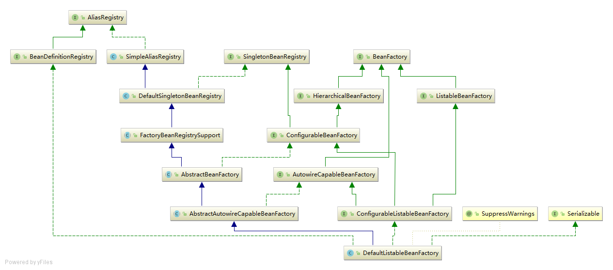
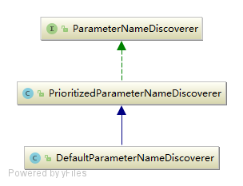

#### AbstractApplicationContext refresh
```java
@Override
public void refresh() throws BeansException, IllegalStateException {
	// startupShutdownMonitor 用来监视容器的刷新和销毁
  synchronized (this.startupShutdownMonitor) {
    // Prepare this context for refreshing 设置容器状态为active, 验证环境中必须的属性
    prepareRefresh();

    // Tell the subclass to refresh the internal bean factory.
    ConfigurableListableBeanFactory beanFactory = obtainFreshBeanFactory();

    // Prepare the bean factory for use in this context.
    prepareBeanFactory(beanFactory);

    try {
      // Allows post-processing of the bean factory in context subclasses.
      postProcessBeanFactory(beanFactory);

      // Invoke factory processors registered as beans in the context.
      invokeBeanFactoryPostProcessors(beanFactory);

      // Register bean processors that intercept bean creation.
      registerBeanPostProcessors(beanFactory);

      // Initialize message source for this context.
      initMessageSource();

      // Initialize event multicaster for this context.
      initApplicationEventMulticaster();

      // Initialize other special beans in specific context subclasses.
      onRefresh();

      // Check for listener beans and register them.
      registerListeners();

      // Instantiate all remaining (non-lazy-init) singletons.
      finishBeanFactoryInitialization(beanFactory);

      // Last step: publish corresponding event.
      finishRefresh();
    }

    catch (BeansException ex) {
      if (logger.isWarnEnabled()) {
        logger.warn("Exception encountered during context initialization - " +
            "cancelling refresh attempt: " + ex);
      }

      // Destroy already created singletons to avoid dangling resources.
			
      destroyBeans();

      // Reset 'active' flag.
      cancelRefresh(ex);

      // Propagate exception to caller.
      throw ex;
    }

    finally {
      // Reset common introspection caches in Spring's core, since we
      // might not ever need metadata for singleton beans anymore...
      resetCommonCaches();
    }
  }
}
```
<details>    
<summary>AbstractApplicationContext refresh->prepareRefresh</summary>
	
#### AbstractApplicationContext refresh->prepareRefresh
```java
protected void prepareRefresh() {
  this.startupDate = System.currentTimeMillis();
	/**
		为什么需要active和closed两个变量来控制开关？
		如果只有一个变量，只能表达简单的是否关系，不能表达开始关闭和关闭完成2个概念
		两个变量体现了关闭有一个过程，closed等于true的时候上下文并没有完全关闭，只代表开始关闭，
		只有当active为false的时候才说明上下文关闭了
	*/
  this.closed.set(false);
  this.active.set(true);

  if (logger.isDebugEnabled()) {
    if (logger.isTraceEnabled()) {
      logger.trace("Refreshing " + this);
    }
    else {
      logger.debug("Refreshing " + getDisplayName());
    }
  }

  // Initialize any placeholder property sources in the context environment
  initPropertySources(); // 子类去实现

  // Validate that all properties marked as required are resolvable
  // see ConfigurablePropertyResolver#setRequiredProperties
  // 验证环境中必须的属性是否存在
  getEnvironment().validateRequiredProperties();

  // Allow for the collection of early ApplicationEvents,
  // to be published once the multicaster is available...
  this.earlyApplicationEvents = new LinkedHashSet<>();
}
 ```

<details>    
<summary>getEnvironment().validateRequiredProperties()</summary>
环境类有属性解析的功能，通过组合属性解析器 AbstractPropertyResolver 实现的
属性解析器是在AbstractRefreshableConfigApplicationContext.setConfigLocations中完成的实例化  

#### AbstractEnvironment
```java
public void validateRequiredProperties() throws MissingRequiredPropertiesException {
  this.propertyResolver.validateRequiredProperties();
}
```

#### AbstractPropertyResolver
```java
public void validateRequiredProperties() {
  MissingRequiredPropertiesException ex = new MissingRequiredPropertiesException();
  for (String key : this.requiredProperties) {
    if (this.getProperty(key) == null) {
      ex.addMissingRequiredProperty(key);
    }
  }
  if (!ex.getMissingRequiredProperties().isEmpty()) {
    throw ex;
  }
}
```
</details>

[回到AbstractApplicationContext refresh->prepareRefresh](refresh.md#abstractapplicationcontext-refresh-preparerefresh)

</details>


<details>    
<summary>AbstractApplicationContext refresh->obtainFreshBeanFactory</summary>
	
#### AbstractApplicationContext refresh->obtainFreshBeanFactory
```java
protected ConfigurableListableBeanFactory obtainFreshBeanFactory() {
  refreshBeanFactory();
  return getBeanFactory();
}
```

<details>    
<summary>AbstractApplicationContext refresh->obtainFreshBeanFactory >> AbstractRefreshableApplicationContext.refreshBeanFactory</summary>
	
#####  AbstractApplicationContext refresh->obtainFreshBeanFactory >> AbstractRefreshableApplicationContext.refreshBeanFactory
AbstractRefreshableApplicationContext
```java
protected final void refreshBeanFactory() throws BeansException {
  if (hasBeanFactory()) {
    destroyBeans();
    closeBeanFactory();
  }
  try {
    DefaultListableBeanFactory beanFactory = createBeanFactory();
    beanFactory.setSerializationId(getId());
    customizeBeanFactory(beanFactory);
    loadBeanDefinitions(beanFactory);
    synchronized (this.beanFactoryMonitor) {
      this.beanFactory = beanFactory;
    }
  }
  catch (IOException ex) {
    throw new ApplicationContextException("I/O error parsing bean definition source for " + getDisplayName(), ex);
  }
}

protected final boolean hasBeanFactory() {
  synchronized (this.beanFactoryMonitor) {
    return (this.beanFactory != null);
  }
}

// 这里新建一个DefaultListableBeanFactory, 
// AbstractApplicationContext refresh->obtainFreshBeanFactory >> AbstractRefreshableApplicationContext.refreshBeanFactory->createBeanFactory
protected DefaultListableBeanFactory createBeanFactory() {
  return new DefaultListableBeanFactory(getInternalParentBeanFactory());
}
```
<details>    
<summary>DefaultListableBeanFactory 初始化</summary>
	
#### DefaultListableBeanFactory 初始化

```java
DefaultListableBeanFactory 静态代码
static {
  try {
    javaxInjectProviderClass =
        ClassUtils.forName("javax.inject.Provider", DefaultListableBeanFactory.class.getClassLoader());
  } catch (ClassNotFoundException ex) {
    // JSR-330 API not available - Provider interface simply not supported then.
    javaxInjectProviderClass = null;
  }
}

private static final Map<String, Reference<DefaultListableBeanFactory>> serializableFactories = new ConcurrentHashMap<>(8);
```

AbstractApplicationContext.getInternalParentBeanFactory 返回null
```java
protected BeanFactory getInternalParentBeanFactory() {
  return (getParent() instanceof ConfigurableApplicationContext ?
      ((ConfigurableApplicationContext) getParent()).getBeanFactory() : getParent());
}
```

DefaultListableBeanFactory 
```java
public DefaultListableBeanFactory(@Nullable BeanFactory parentBeanFactory) {
	super(parentBeanFactory);
}
```

AbstractAutowireCapableBeanFactory
```java
public AbstractAutowireCapableBeanFactory(@Nullable BeanFactory parentBeanFactory) {
  this();
  setParentBeanFactory(parentBeanFactory);
}
public AbstractAutowireCapableBeanFactory() {
  super();
  ignoreDependencyInterface(BeanNameAware.class);
  ignoreDependencyInterface(BeanFactoryAware.class);
  ignoreDependencyInterface(BeanClassLoaderAware.class);
}
```

SimpleAliasRegistry
```java
protected final Log logger = LogFactory.getLog(getClass());

// 候选名字
private final Map<String, String> aliasMap = new ConcurrentHashMap<>(16);
```

DefaultSingletonBeanRegistry
```java
// 缓存单例
private final Map<String, Object> singletonObjects = new ConcurrentHashMap<>(256);
// 缓存factories
private final Map<String, ObjectFactory<?>> singletonFactories = new HashMap<>(16);
// 缓存早期单例
private final Map<String, Object> earlySingletonObjects = new HashMap<>(16);
// 保存了单例的注册顺序
private final Set<String> registeredSingletons = new LinkedHashSet<>(256);
// 正在创建的单例
private final Set<String> singletonsCurrentlyInCreation = Collections.newSetFromMap(new ConcurrentHashMap<>(16));
// 不需要创建检查的单例
private final Set<String> inCreationCheckExclusions = Collections.newSetFromMap(new ConcurrentHashMap<>(16));
// 是否正在销毁bean
private boolean singletonsCurrentlyInDestruction = false;
// 映射diposablebean
private final Map<String, Object> disposableBeans = new LinkedHashMap<>();
// 组合关系一个bean包含了多少其它bean
private final Map<String, Set<String>> containedBeanMap = new ConcurrentHashMap<>(16);
// dependent映射
private final Map<String, Set<String>> dependentBeanMap = new ConcurrentHashMap<>(64);
// bean到dependency的映射
private final Map<String, Set<String>> dependenciesForBeanMap = new ConcurrentHashMap<>(64);
```


FactoryBeanRegistrySupport
```java
// 缓存FactoryBean创建的实例
private final Map<String, Object> factoryBeanObjectCache = new ConcurrentHashMap<>(16);
```
 
AbstractBeanFactory
```java
public AbstractBeanFactory() {
}

@Nullable
private ClassLoader beanClassLoader = ClassUtils.getDefaultClassLoader();

// 是否缓存beanMetaData
private boolean cacheBeanMetadata = true;

// 会应用到该工厂的所有bean
private final Set<PropertyEditorRegistrar> propertyEditorRegistrars = new LinkedHashSet<>(4);
private final Map<Class<?>, Class<? extends PropertyEditor>> customEditors = new HashMap<>(4);

// 注解属性值相关
private final List<StringValueResolver> embeddedValueResolvers = new CopyOnWriteArrayList<>();

// 后置处理器
private final List<BeanPostProcessor> beanPostProcessors = new CopyOnWriteArrayList<>();

// scope 缓存
private final Map<String, Scope> scopes = new LinkedHashMap<>(8);

// RootBeanDefinition映射
private final Map<String, RootBeanDefinition> mergedBeanDefinitions = new ConcurrentHashMap<>(256);

// 
private final Set<String> alreadyCreated = Collections.newSetFromMap(new ConcurrentHashMap<>(256));

// 正在创建的bean
private final ThreadLocal<Object> prototypesCurrentlyInCreation = new NamedThreadLocal<>("Prototype beans currently in creation");
```


AbstractAutowireCapableBeanFactory
```java
// cglib代理策略
private InstantiationStrategy instantiationStrategy = new CglibSubclassingInstantiationStrategy();

// 处理参数名称
private ParameterNameDiscoverer parameterNameDiscoverer = new DefaultParameterNameDiscoverer();
// 是否允许循环引用
private boolean allowCircularReferences = true;
// 插入rawbean 避免循环引用
private boolean allowRawInjectionDespiteWrapping = false;
// 类型检查和自动导入的时候忽略的类型
private final Set<Class<?>> ignoredDependencyTypes = new HashSet<>();
// 类型检查和自动导入的时候忽略的接口
private final Set<Class<?>> ignoredDependencyInterfaces = new HashSet<>();
// 当前正在创建的bean
private final NamedThreadLocal<String> currentlyCreatedBean = new NamedThreadLocal<>("Currently created bean");
// 尚未创建好的factorybean实例
private final ConcurrentMap<String, BeanWrapper> factoryBeanInstanceCache = new ConcurrentHashMap<>();
// 缓存工厂类的候选工厂方法
private final ConcurrentMap<Class<?>, Method[]> factoryMethodCandidateCache = new ConcurrentHashMap<>();
// 类对应的PropertyDescriptor
private final ConcurrentMap<Class<?>, PropertyDescriptor[]> filteredPropertyDescriptorsCache = new ConcurrentHashMap<>();
```

  

SimpleInstantiationStrategy
```java
private static final ThreadLocal<Method> currentlyInvokedFactoryMethod = new ThreadLocal<>();
```

  
	
PrioritizedParameterNameDiscoverer
```java
private final List<ParameterNameDiscoverer> parameterNameDiscoverers = new LinkedList<>();
```

DefaultParameterNameDiscoverer
```java
public DefaultParameterNameDiscoverer() {
  if (!GraalDetector.inImageCode()) {
    if (KotlinDetector.isKotlinReflectPresent()) {
      addDiscoverer(new KotlinReflectionParameterNameDiscoverer());
    }
    addDiscoverer(new StandardReflectionParameterNameDiscoverer());
    addDiscoverer(new LocalVariableTableParameterNameDiscoverer());
  }
}
```
LocalVariableTableParameterNameDiscoverer
```java
private static final Log logger = LogFactory.getLog(LocalVariableTableParameterNameDiscoverer.class);
// 没有调试信息的class
private static final Map<Member, String[]> NO_DEBUG_INFO_MAP = Collections.emptyMap();
// 使用map作为值（分组管理），让key更小
private final Map<Class<?>, Map<Member, String[]>> parameterNamesCache = new ConcurrentHashMap<>(32);
```

AbstractBeanFactory
```java
public void setParentBeanFactory(@Nullable BeanFactory parentBeanFactory) {
  if (this.parentBeanFactory != null && this.parentBeanFactory != parentBeanFactory) {
    throw new IllegalStateException("Already associated with parent BeanFactory: " + this.parentBeanFactory);
  }
  this.parentBeanFactory = parentBeanFactory;
}
```

DefaultListableBeanFactory
```java
// 是否允许同名的bean覆盖
private boolean allowBeanDefinitionOverriding = true;
// 是否允许急切加载，忽略lazy-init
private boolean allowEagerClassLoading = true;
// 检查是否为Autowire candidate
private AutowireCandidateResolver autowireCandidateResolver = new SimpleAutowireCandidateResolver();
// 可自动导入值
private final Map<Class<?>, Object> resolvableDependencies = new ConcurrentHashMap<>(16);
// bean定义的缓存
private final Map<String, BeanDefinition> beanDefinitionMap = new ConcurrentHashMap<>(256);
// 所有类型到名字的映射
private final Map<Class<?>, String[]> allBeanNamesByType = new ConcurrentHashMap<>(64);
// 单例到名字的映射
private final Map<Class<?>, String[]> singletonBeanNamesByType = new ConcurrentHashMap<>(64);
// bean定义顺序
private volatile List<String> beanDefinitionNames = new ArrayList<>(256);
// 手动注册的bean名字
private volatile Set<String> manualSingletonNames = new LinkedHashSet<>(16);
// 缓存metadata
private volatile boolean configurationFrozen = false;
```

[回到 DefaultListableBeanFactory 初始化](defaultlistablebeanfactory-%E5%88%9D%E5%A7%8B%E5%8C%96)
</details> 


#### AbstractRefreshableApplicationContext customizeBeanFactory
```java
protected void customizeBeanFactory(DefaultListableBeanFactory beanFactory) {
	if (this.allowBeanDefinitionOverriding != null) {
		beanFactory.setAllowBeanDefinitionOverriding(this.allowBeanDefinitionOverriding);
	}
	if (this.allowCircularReferences != null) {
		beanFactory.setAllowCircularReferences(this.allowCircularReferences);
	}
}
```
#### AbstractRefreshableApplicationContext loadBeanDefinitions
```java
@Override
protected void loadBeanDefinitions(DefaultListableBeanFactory beanFactory) throws BeansException, IOException {
	// Create a new XmlBeanDefinitionReader for the given BeanFactory.
	XmlBeanDefinitionReader beanDefinitionReader = new XmlBeanDefinitionReader(beanFactory);

	// Configure the bean definition reader with this context's
	// resource loading environment.
	beanDefinitionReader.setEnvironment(this.getEnvironment());
	beanDefinitionReader.setResourceLoader(this);
	beanDefinitionReader.setEntityResolver(new ResourceEntityResolver(this));

	// Allow a subclass to provide custom initialization of the reader,
	// then proceed with actually loading the bean definitions.
	initBeanDefinitionReader(beanDefinitionReader);
	loadBeanDefinitions(beanDefinitionReader);
}


```


<details>    
<summary> XmlBeanDefinitionReader beanDefinitionReader = new XmlBeanDefinitionReader(beanFactory);</summary>
	

#### XmlBeanDefinitionReader
```java
private static final Constants constants = new Constants(XmlBeanDefinitionReader.class);

private int validationMode = VALIDATION_AUTO;

private boolean namespaceAware = false;

private Class<? extends BeanDefinitionDocumentReader> documentReaderClass =
			DefaultBeanDefinitionDocumentReader.class;

private ProblemReporter problemReporter = new FailFastProblemReporter();

private ReaderEventListener eventListener = new EmptyReaderEventListener();

private SourceExtractor sourceExtractor = new NullSourceExtractor();

private DocumentLoader documentLoader = new DefaultDocumentLoader();

private ErrorHandler errorHandler = new SimpleSaxErrorHandler(logger);

private final XmlValidationModeDetector validationModeDetector = new XmlValidationModeDetector();

private final ThreadLocal<Set<EncodedResource>> resourcesCurrentlyBeingLoaded =
		new NamedThreadLocal<>("XML bean definition resources currently being loaded");
// 到这里XmlBeanDefinitionReader初始化完成


public XmlBeanDefinitionReader(BeanDefinitionRegistry registry) {
	super(registry);
}	

```

#### Constants
工具类，用来通过名字访问指定类的public final字段
```java
// key:public final字段的名称  value:public final字段的值
private final Map<String, Object> fieldCache = new HashMap<>();
```

#### AbstractBeanDefinitionReader
```java
protected final Log logger = LogFactory.getLog(getClass());

private BeanNameGenerator beanNameGenerator = new DefaultBeanNameGenerator();

protected AbstractBeanDefinitionReader(BeanDefinitionRegistry registry) {
	Assert.notNull(registry, "BeanDefinitionRegistry must not be null");
	this.registry = registry;

	// Determine ResourceLoader to use.
	if (this.registry instanceof ResourceLoader) {
		this.resourceLoader = (ResourceLoader) this.registry;
	}
	else {
		this.resourceLoader = new PathMatchingResourcePatternResolver();
	}

	// Inherit Environment if possible
	if (this.registry instanceof EnvironmentCapable) {
		this.environment = ((EnvironmentCapable) this.registry).getEnvironment();
	}
	else {
		this.environment = new StandardEnvironment();
	}
}

```


[回到 XmlBeanDefinitionReader](#xmlbeandefinitionreader)
</details>


#### AbstractXmlApplicationContext loadBeanDefinitions(beanDefinitionReader);
```java
// 这里先从resource加载资源，再重location加载资源  分别代表什么资源？
protected void loadBeanDefinitions(XmlBeanDefinitionReader reader) throws BeansException, IOException {
	Resource[] configResources = getConfigResources();
	if (configResources != null) {
		reader.loadBeanDefinitions(configResources);
	}
	String[] configLocations = getConfigLocations();
	if (configLocations != null) {
		reader.loadBeanDefinitions(configLocations);
	}
}
```


```java
// AbstractBeanDefinitionReader   locations:cc/learn/beans/beans.xml
public int loadBeanDefinitions(String... locations) throws BeanDefinitionStoreException {
	Assert.notNull(locations, "Location array must not be null");
	int count = 0;
	for (String location : locations) {
		count += loadBeanDefinitions(location);
	}
	return count;
}

public int loadBeanDefinitions(String location) throws BeanDefinitionStoreException {
	return loadBeanDefinitions(location, null);
}

public int loadBeanDefinitions(String location, @Nullable Set<Resource> actualResources) throws BeanDefinitionStoreException {
	ResourceLoader resourceLoader = getResourceLoader();
	if (resourceLoader == null) {
		throw new BeanDefinitionStoreException(
				"Cannot load bean definitions from location [" + location + "]: no ResourceLoader available");
	}

	if (resourceLoader instanceof ResourcePatternResolver) {
		// Resource pattern matching available.
		try {
			// 这里仍然会把location转化为Resource
			Resource[] resources = ((ResourcePatternResolver) resourceLoader).getResources(location);
			int count = loadBeanDefinitions(resources);
			if (actualResources != null) {
				Collections.addAll(actualResources, resources);
			}
			if (logger.isTraceEnabled()) {
				logger.trace("Loaded " + count + " bean definitions from location pattern [" + location + "]");
			}
			return count;
		}
		catch (IOException ex) {
			throw new BeanDefinitionStoreException(
					"Could not resolve bean definition resource pattern [" + location + "]", ex);
		}
	}
	else {
		// Can only load single resources by absolute URL.
		Resource resource = resourceLoader.getResource(location);
		int count = loadBeanDefinitions(resource);
		if (actualResources != null) {
			actualResources.add(resource);
		}
		if (logger.isTraceEnabled()) {
			logger.trace("Loaded " + count + " bean definitions from location [" + location + "]");
		}
		return count;
	}
}

public int loadBeanDefinitions(Resource... resources) throws BeanDefinitionStoreException {
	Assert.notNull(resources, "Resource array must not be null");
	int count = 0;
	for (Resource resource : resources) {
		count += loadBeanDefinitions(resource);
	}
	return count;
}


```

```java
// XmlBeanDefinitionReader
public int loadBeanDefinitions(Resource resource) throws BeanDefinitionStoreException {
	return loadBeanDefinitions(new EncodedResource(resource));
}


public int loadBeanDefinitions(EncodedResource encodedResource) throws BeanDefinitionStoreException {
	Assert.notNull(encodedResource, "EncodedResource must not be null");
	if (logger.isTraceEnabled()) {
		logger.trace("Loading XML bean definitions from " + encodedResource);
	}

	Set<EncodedResource> currentResources = this.resourcesCurrentlyBeingLoaded.get();
	if (currentResources == null) {
		currentResources = new HashSet<>(4);
		this.resourcesCurrentlyBeingLoaded.set(currentResources);
	}
	if (!currentResources.add(encodedResource)) {
		throw new BeanDefinitionStoreException(
				"Detected cyclic loading of " + encodedResource + " - check your import definitions!");
	}
	try {
		InputStream inputStream = encodedResource.getResource().getInputStream();
		try {
			InputSource inputSource = new InputSource(inputStream);
			if (encodedResource.getEncoding() != null) {
				inputSource.setEncoding(encodedResource.getEncoding());
			}
			return doLoadBeanDefinitions(inputSource, encodedResource.getResource());
		}
		finally {
			inputStream.close();
		}
	}
	catch (IOException ex) {
		throw new BeanDefinitionStoreException(
				"IOException parsing XML document from " + encodedResource.getResource(), ex);
	}
	finally {
		currentResources.remove(encodedResource);
		if (currentResources.isEmpty()) {
			this.resourcesCurrentlyBeingLoaded.remove();
		}
	}
}

protected int doLoadBeanDefinitions(InputSource inputSource, Resource resource)
			throws BeanDefinitionStoreException {
	try {
		Document doc = doLoadDocument(inputSource, resource);
		int count = registerBeanDefinitions(doc, resource);
		if (logger.isDebugEnabled()) {
			logger.debug("Loaded " + count + " bean definitions from " + resource);
		}
		return count;
	}catch...

protected Document doLoadDocument(InputSource inputSource, Resource resource) throws Exception {
	return this.documentLoader.loadDocument(inputSource, getEntityResolver(), this.errorHandler,
			getValidationModeForResource(resource), isNamespaceAware());
}


```

#### DefaultDocumentLoader
```java
public Document loadDocument(InputSource inputSource, EntityResolver entityResolver,
		ErrorHandler errorHandler, int validationMode, boolean namespaceAware) throws Exception {

	DocumentBuilderFactory factory = createDocumentBuilderFactory(validationMode, namespaceAware);
	if (logger.isTraceEnabled()) {
		logger.trace("Using JAXP provider [" + factory.getClass().getName() + "]");
	}
	DocumentBuilder builder = createDocumentBuilder(factory, entityResolver, errorHandler);
	return builder.parse(inputSource);
}


```

```java
// XmlBeanDefinitionReader
// int count = registerBeanDefinitions(doc, resource);
public int registerBeanDefinitions(Document doc, Resource resource) throws BeanDefinitionStoreException {
	BeanDefinitionDocumentReader documentReader = createBeanDefinitionDocumentReader();
	int countBefore = getRegistry().getBeanDefinitionCount();
	documentReader.registerBeanDefinitions(doc, createReaderContext(resource));
	return getRegistry().getBeanDefinitionCount() - countBefore;
}

```

#### DefaultBeanDefinitionDocumentReader
```java
public void registerBeanDefinitions(Document doc, XmlReaderContext readerContext) {
	this.readerContext = readerContext;
	doRegisterBeanDefinitions(doc.getDocumentElement());
}

protected void doRegisterBeanDefinitions(Element root) {
	// Any nested <beans> elements will cause recursion in this method. In
	// order to propagate and preserve <beans> default-* attributes correctly,
	// keep track of the current (parent) delegate, which may be null. Create
	// the new (child) delegate with a reference to the parent for fallback purposes,
	// then ultimately reset this.delegate back to its original (parent) reference.
	// this behavior emulates a stack of delegates without actually necessitating one.
	BeanDefinitionParserDelegate parent = this.delegate;
	this.delegate = createDelegate(getReaderContext(), root, parent);

	if (this.delegate.isDefaultNamespace(root)) {
		String profileSpec = root.getAttribute(PROFILE_ATTRIBUTE);
		if (StringUtils.hasText(profileSpec)) {
			String[] specifiedProfiles = StringUtils.tokenizeToStringArray(
					profileSpec, BeanDefinitionParserDelegate.MULTI_VALUE_ATTRIBUTE_DELIMITERS);
			// We cannot use Profiles.of(...) since profile expressions are not supported
			// in XML config. See SPR-12458 for details.
			if (!getReaderContext().getEnvironment().acceptsProfiles(specifiedProfiles)) {
				if (logger.isDebugEnabled()) {
					logger.debug("Skipped XML bean definition file due to specified profiles [" + profileSpec +
							"] not matching: " + getReaderContext().getResource());
				}
				return;
			}
		}
	}

	preProcessXml(root);
	parseBeanDefinitions(root, this.delegate);
	postProcessXml(root);

	this.delegate = parent;
}

protected void parseBeanDefinitions(Element root, BeanDefinitionParserDelegate delegate) {
	if (delegate.isDefaultNamespace(root)) {
		NodeList nl = root.getChildNodes();
		for (int i = 0; i < nl.getLength(); i++) {
			Node node = nl.item(i);
			if (node instanceof Element) {
				Element ele = (Element) node;
				if (delegate.isDefaultNamespace(ele)) {
					parseDefaultElement(ele, delegate);
				}
				else {
					delegate.parseCustomElement(ele);
				}
			}
		}
	}
	else {
		delegate.parseCustomElement(root);
	}
}

private void parseDefaultElement(Element ele, BeanDefinitionParserDelegate delegate) {
	if (delegate.nodeNameEquals(ele, IMPORT_ELEMENT)) {
		importBeanDefinitionResource(ele);
	}
	else if (delegate.nodeNameEquals(ele, ALIAS_ELEMENT)) {
		processAliasRegistration(ele);
	}
	else if (delegate.nodeNameEquals(ele, BEAN_ELEMENT)) {
		processBeanDefinition(ele, delegate);
	}
	else if (delegate.nodeNameEquals(ele, NESTED_BEANS_ELEMENT)) {
		// recurse
		doRegisterBeanDefinitions(ele);
	}
}

protected void processBeanDefinition(Element ele, BeanDefinitionParserDelegate delegate) {
	BeanDefinitionHolder bdHolder = delegate.parseBeanDefinitionElement(ele);
	if (bdHolder != null) {
		bdHolder = delegate.decorateBeanDefinitionIfRequired(ele, bdHolder);
		try {
			// Register the final decorated instance.
			BeanDefinitionReaderUtils.registerBeanDefinition(bdHolder, getReaderContext().getRegistry());
		}
		catch (BeanDefinitionStoreException ex) {
			getReaderContext().error("Failed to register bean definition with name '" +
					bdHolder.getBeanName() + "'", ele, ex);
		}
		// Send registration event.
		getReaderContext().fireComponentRegistered(new BeanComponentDefinition(bdHolder));
	}
}
```

#### BeanDefinitionReaderUtils
```java
public static void registerBeanDefinition(
		BeanDefinitionHolder definitionHolder, BeanDefinitionRegistry registry)
		throws BeanDefinitionStoreException {

	// Register bean definition under primary name.
	String beanName = definitionHolder.getBeanName();
	registry.registerBeanDefinition(beanName, definitionHolder.getBeanDefinition());

	// Register aliases for bean name, if any.
	String[] aliases = definitionHolder.getAliases();
	if (aliases != null) {
		for (String alias : aliases) {
			registry.registerAlias(beanName, alias);
		}
	}
}
```


```java
// DefaultListableBeanFactory
public void registerBeanDefinition(String beanName, BeanDefinition beanDefinition)
			throws BeanDefinitionStoreException {

	Assert.hasText(beanName, "Bean name must not be empty");
	Assert.notNull(beanDefinition, "BeanDefinition must not be null");

	if (beanDefinition instanceof AbstractBeanDefinition) {
		try {
			((AbstractBeanDefinition) beanDefinition).validate();
		} catch (BeanDefinitionValidationException ex) {
			throw new BeanDefinitionStoreException(beanDefinition.getResourceDescription(), beanName,
					"Validation of bean definition failed", ex);
		}
	}

	BeanDefinition existingDefinition = this.beanDefinitionMap.get(beanName);
	if (existingDefinition != null) {
		if (!isAllowBeanDefinitionOverriding()) {
			throw new BeanDefinitionOverrideException(beanName, beanDefinition, existingDefinition);
		} else if (existingDefinition.getRole() < beanDefinition.getRole()) {
			// e.g. was ROLE_APPLICATION, now overriding with ROLE_SUPPORT or ROLE_INFRASTRUCTURE
			if (logger.isInfoEnabled()) {
				logger.info("Overriding user-defined bean definition for bean '" + beanName +
						"' with a framework-generated bean definition: replacing [" +
						existingDefinition + "] with [" + beanDefinition + "]");
			}
		} else if (!beanDefinition.equals(existingDefinition)) {
			if (logger.isDebugEnabled()) {
				logger.debug("Overriding bean definition for bean '" + beanName +
						"' with a different definition: replacing [" + existingDefinition +
						"] with [" + beanDefinition + "]");
			}
		} else {
			if (logger.isTraceEnabled()) {
				logger.trace("Overriding bean definition for bean '" + beanName +
						"' with an equivalent definition: replacing [" + existingDefinition +
						"] with [" + beanDefinition + "]");
			}
		}
		this.beanDefinitionMap.put(beanName, beanDefinition);
	} else {
		if (hasBeanCreationStarted()) {
			// Cannot modify startup-time collection elements anymore (for stable iteration)
			synchronized (this.beanDefinitionMap) {
				this.beanDefinitionMap.put(beanName, beanDefinition);
				List<String> updatedDefinitions = new ArrayList<>(this.beanDefinitionNames.size() + 1);
				updatedDefinitions.addAll(this.beanDefinitionNames);
				updatedDefinitions.add(beanName);
				this.beanDefinitionNames = updatedDefinitions;
				if (this.manualSingletonNames.contains(beanName)) {
					Set<String> updatedSingletons = new LinkedHashSet<>(this.manualSingletonNames);
					updatedSingletons.remove(beanName);
					this.manualSingletonNames = updatedSingletons;
				}
			}
		} else {
			// Still in startup registration phase
			this.beanDefinitionMap.put(beanName, beanDefinition);
			this.beanDefinitionNames.add(beanName);
			this.manualSingletonNames.remove(beanName);
		}
		this.frozenBeanDefinitionNames = null;
	}

	if (existingDefinition != null || containsSingleton(beanName)) {
		resetBeanDefinition(beanName);
	}
}


```

[回到refreshBeanFactory](abstractapplicationcontext-refresh-obtainfreshbeanfactory)  

</details>   

 [回到AbstractApplicationContext refresh->obtainFreshBeanFactory](refresh.md#abstractapplicationcontext-refresh-obtainfreshbeanfactory)  
 
 </details>  
